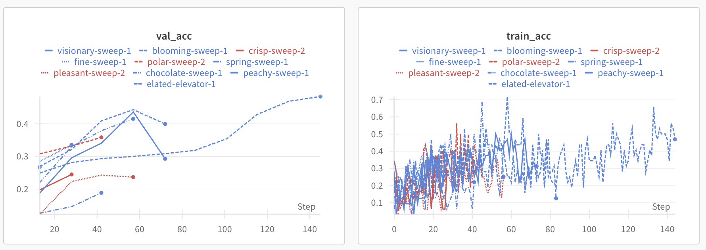
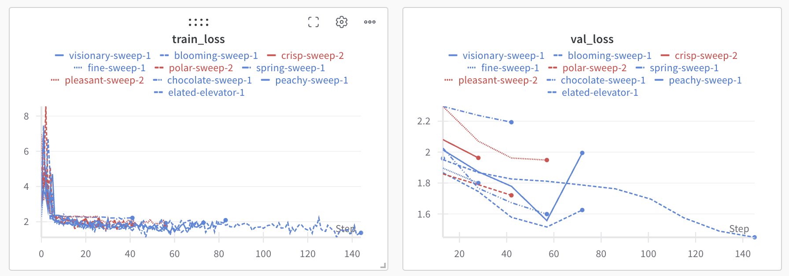
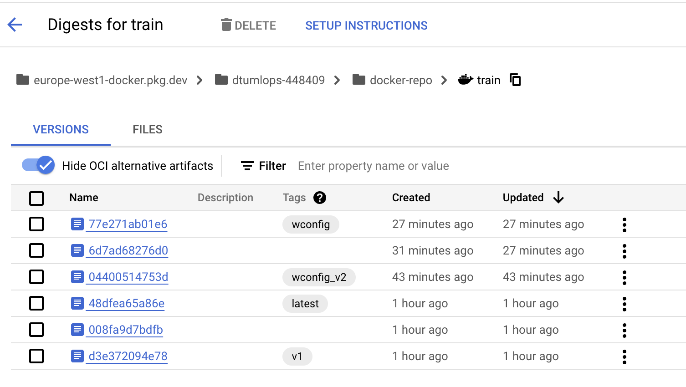
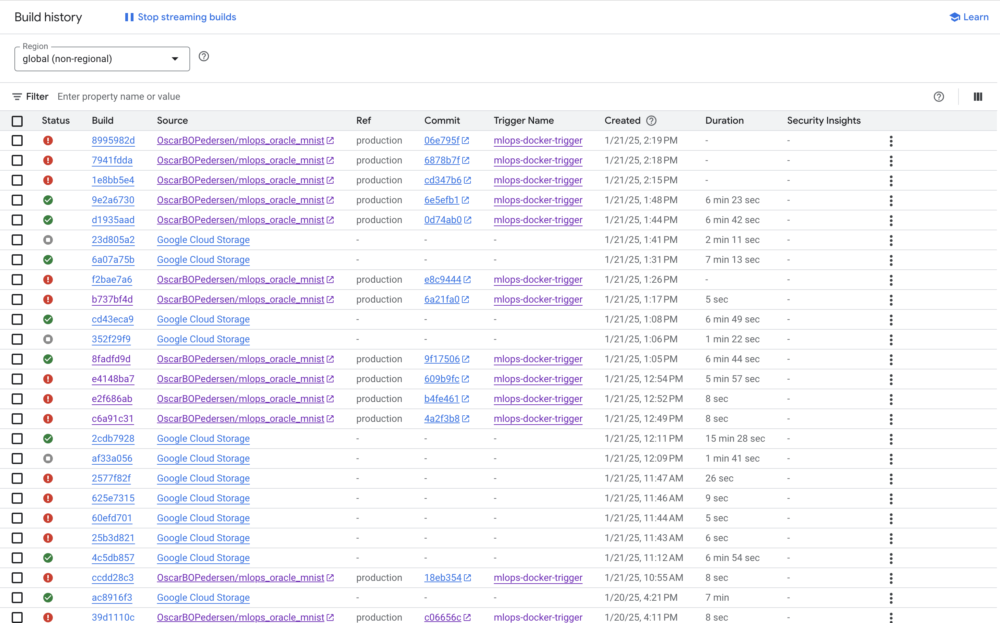
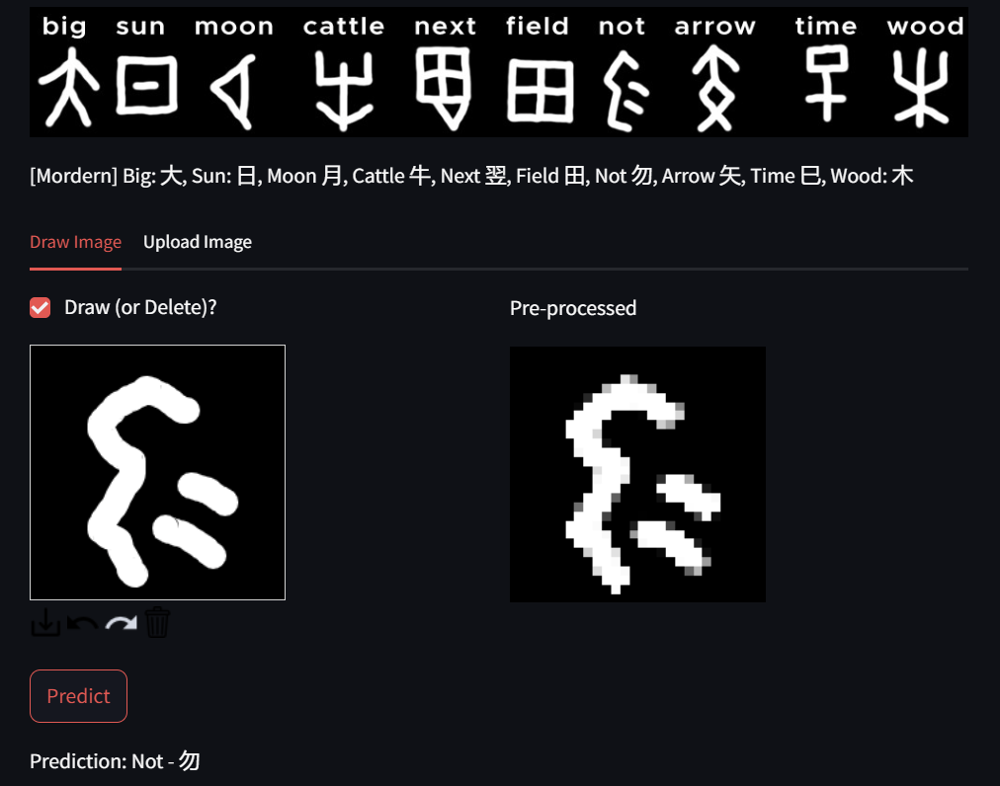
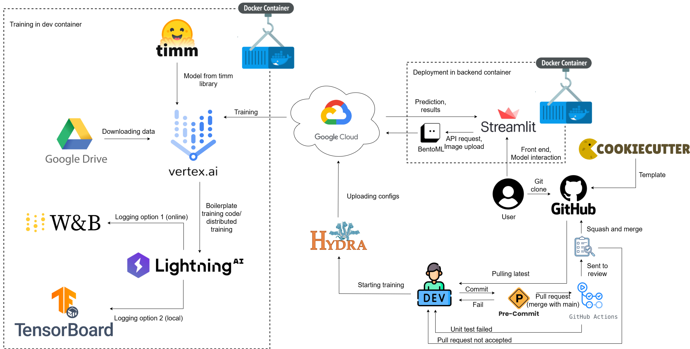

# Exam template for 02476 Machine Learning Operations

This is the report template for the exam. Please only remove the text formatted as with three dashes in front and behind
like:

```--- question 1 fill here ---```

Where you instead should add your answers. Any other changes may have unwanted consequences when your report is
auto-generated at the end of the course. For questions where you are asked to include images, start by adding the image
to the `figures` subfolder (please only use `.png`, `.jpg` or `.jpeg`) and then add the following code in your answer:

```markdown

```

In addition to this markdown file, we also provide the `report.py` script that provides two utility functions:

Running:

```bash
python report.py html
```

Will generate a `.html` page of your report. After the deadline for answering this template, we will auto-scrape
everything in this `reports` folder and then use this utility to generate a `.html` page that will be your serve
as your final hand-in.

Running

```bash
python report.py check
```

Will check your answers in this template against the constraints listed for each question e.g. is your answer too
short, too long, or have you included an image when asked. For both functions to work you mustn't rename anything.
The script has two dependencies that can be installed with

```bash
pip install typer markdown
```

## Overall project checklist

The checklist is *exhaustive* which means that it includes everything that you could do on the project included in the
curriculum in this course. Therefore, we do not expect at all that you have checked all boxes at the end of the project.
The parenthesis at the end indicates what module the bullet point is related to. Please be honest in your answers, we
will check the repositories and the code to verify your answers.

### Week 1

* [x] Create a git repository (M5)
* [x] Make sure that all team members have write access to the GitHub repository (M5)
* [x] Create a dedicated environment for you project to keep track of your packages (M2)
* [x] Create the initial file structure using cookiecutter with an appropriate template (M6)
* [x] Fill out the `data.py` file such that it downloads whatever data you need and preprocesses it (if necessary) (M6)
* [x] Add a model to `train_module.py` and a training procedure to `train.py` and get that running (M6)
* [x] Remember to fill out the `requirements.txt` and `requirements_dev.txt` file with whatever dependencies that you
    are using (M2+M6)
* [x] Remember to comply with good coding practices (`pep8`) while doing the project (M7)
* [x] Do a bit of code typing and remember to document essential parts of your code (M7)
* [ ] Setup version control for your data or part of your data (M8)
* [x] Add command line interfaces and project commands to your code where it makes sense (M9)
* [x] Construct one or multiple docker files for your code (M10)
* [x] Build the docker files locally and make sure they work as intended (M10)
* [x] Write one or multiple configurations files for your experiments (M11)
* [x] Used Hydra to load the configurations and manage your hyperparameters (M11)
* [ ] Use profiling to optimize your code (M12)
* [x] Use logging to log important events in your code (M14)
* [x] Use Weights & Biases to log training progress and other important metrics/artifacts in your code (M14)
* [ ] Consider running a hyperparameter optimization sweep (M14)
* [x] Use PyTorch-lightning (if applicable) to reduce the amount of boilerplate in your code (M15)

### Week 2

* [x] Write unit tests related to the data part of your code (M16)
* [x] Write unit tests related to model construction and or model training (M16)
* [x] Calculate the code coverage (M16)
* [x] Get some continuous integration running on the GitHub repository (M17)
* [x] Add caching and multi-os/python/pytorch testing to your continuous integration (M17)
* [x] Add a linting step to your continuous integration (M17)
* [x] Add pre-commit hooks to your version control setup (M18)
* [ ] Add a continues workflow that triggers when data changes (M19)
* [ ] Add a continues workflow that triggers when changes to the model registry is made (M19)
* [ ] Create a data storage in GCP Bucket for your data and link this with your data version control setup (M21)
* [x] Create a trigger workflow for automatically building your docker images (M21)
* [x] Get your model training in GCP using either the Engine or Vertex AI (M21)
* [x] Create a FastAPI application that can do inference using your model (M22)
* [ ] Deploy your model in GCP using either Functions or Run as the backend (M23)
* [ ] Write API tests for your application and setup continues integration for these (M24)
* [ ] Load test your application (M24)
* [x] Create a more specialized ML-deployment API using either ONNX or BentoML, or both (M25)
* [x] Create a frontend for your API (M26)

### Week 3

* [ ] Check how robust your model is towards data drifting (M27)
* [ ] Deploy to the cloud a drift detection API (M27)
* [ ] Instrument your API with a couple of system metrics (M28)
* [ ] Setup cloud monitoring of your instrumented application (M28)
* [ ] Create one or more alert systems in GCP to alert you if your app is not behaving correctly (M28)
* [ ] If applicable, optimize the performance of your data loading using distributed data loading (M29)
* [ ] If applicable, optimize the performance of your training pipeline by using distributed training (M30)
* [x] Play around with quantization, compilation and pruning for you trained models to increase inference speed (M31)

### Extra

* [ ] Write some documentation for your application (M32)
* [ ] Publish the documentation to GitHub Pages (M32)
* [ ] Revisit your initial project description. Did the project turn out as you wanted?
* [x] Create an architectural diagram over your MLOps pipeline
* [x] Make sure all group members have an understanding about all parts of the project
* [x] Uploaded all your code to GitHub

## Group information

### Question 1
> **Enter the group number you signed up on <learn.inside.dtu.dk>**
>
> Answer:

Group 19

### Question 2
> **Enter the study number for each member in the group**
>
> Example:
>
> *sXXXXXX, sXXXXXX, sXXXXXX*
>
> Answer:

s181486, s204131, s204243, s194142, s204114

### Question 3
> **A requirement to the project is that you include a third-party package not covered in the course. What framework**
> **did you choose to work with and did it help you complete the project?**
>
> Recommended answer length: 100-200 words.
>
> Example:
> *We used the third-party framework ... in our project. We used functionality ... and functionality ... from the*
> *package to do ... and ... in our project*.
>
> Answer:

The TIMM framework seems like the optimal choice for this project. However in this case this is perhaps a bit overkill as a very simple model should be able to handle this task.

TIMM is a collection of computer vision models hosted on Huggingface. By using TIMM we can test different models against eachother. As an example later apply a hyperparameter sweep where different models by treating the model name as a hyperparamter.

## Coding environment

> In the following section we are interested in learning more about you local development environment. This includes
> how you managed dependencies, the structure of your code and how you managed code quality.

### Question 4

> **Explain how you managed dependencies in your project? Explain the process a new team member would have to go**
> **through to get an exact copy of your environment.**
>
> Recommended answer length: 100-200 words
>
> Example:
> *We used ... for managing our dependencies. The list of dependencies was auto-generated using ... . To get a*
> *complete copy of our development environment, one would have to run the following commands*
>
> Answer:

We kept our dependencies up to date by using and keeping the requirements.txt file updated. We did not use any auto generation of the file, but added dependencies as they became nessisary. We also made use of a docker development image to avoid dealing with issues due to different dev enviroments. A new user would just have to run `invoke docker_build` which will build the appropriate docker images for both training and development (given docker and invoke are installed correctly). We also supply with docker commands for building images for the back and front end.  
We ensure that no requirements are missing by running unit-tests on pull-requests when merging into main.


### Question 5

> **We expect that you initialized your project using the cookiecutter template. Explain the overall structure of your**
> **code. What did you fill out? Did you deviate from the template in some way?**
>
> Recommended answer length: 100-200 words
>
> Example:
> *From the cookiecutter template we have filled out the ... , ... and ... folder. We have removed the ... folder*
> *because we did not use any ... in our project. We have added an ... folder that contains ... for running our*
> *experiments.*
>
> Answer:

For the most part, we kept our selves constrained to the cookie-cutter format. We did not make use of evalaute.py file as we made use of wanb for logging/visualization/evalutaion. In vizualize.py we implemented a ligning callback function which was passed to the trainer.

### Question 6

> **Did you implement any rules for code quality and format? What about typing and documentation? Additionally,**
> **explain with your own words why these concepts matters in larger projects.**
>
> Recommended answer length: 100-200 words.
>
> Example:
> *We used ... for linting and ... for formatting. We also used ... for typing and ... for documentation. These*
> *concepts are important in larger projects because ... . For example, typing ...*
>
> Answer:

We attempted to keep the typing in check for the project, but only for the classes, and not the intiation of classes. We also had some discussions on linting, of which we used the package black to enforce. Code projects can easily balloon in code base size and complexity as more features/dimensions are added. Staying aligned in terms of code style makes it easier for all parties to better understand the code and have aligned mental models of the code in terms of use/need. It also reduces the amount of technical debt.

## Version control

> In the following section we are interested in how version control was used in your project during development to
> corporate and increase the quality of your code.

### Question 7

> **How many tests did you implement and what are they testing in your code?**
>
> Recommended answer length: 50-100 words.
>
> Example:
> *In total we have implemented X tests. Primarily we are testing ... and ... as these the most critical parts of our*
> *application but also ... .*
>
> Answer:

We have implemented 6 tests using unittest split between 3 scripts. test_data.py first tests the dummy data loading to ensure type, dimensions, labels. It then tests the data preparation and setup afterwards. test_model.py runs the trainer for one epoch to ensure it is functional. We also test the model structure afterwards.
Lastly we ran an integration test by both the health and the ability to pass batches through our backend API

### Question 8

> **What is the total code coverage (in percentage) of your code? If your code had a code coverage of 100% (or close**
> **to), would you still trust it to be error free? Explain you reasoning.**
>
> Recommended answer length: 100-200 words.
>
> Example:
> *The total code coverage of code is X%, which includes all our source code. We are far from 100% coverage of our **
> *code and even if we were then...*
>
> Answer:

Total code coverage percent is 48%. This is not close to 100%, but it covers the most essential parts of the data loading, preparation and the model. However, if we had a coverage of 100%, this does not ensure error-free code. Errors can still come from logic issues, untested edge cases, external dependencies, or integration problems.

### Question 9

> **Did you workflow include using branches and pull requests? If yes, explain how. If not, explain how branches and**
> **pull request can help improve version control.**
>
> Recommended answer length: 100-200 words.
>
> Example:
> *We made use of both branches and PRs in our project. In our group, each member had an branch that they worked on in*
> *addition to the main branch. To merge code we ...*
>
> Answer:

We were a little relaxed on our use of branches and PRs. Initially when making the first changes, and not very complicated changes, we commited directly to main. As we started to do more individual development, we made branches and subsequently made PR. One could argue that it would have been smarter to have been stricter with branches and PRs from the start, as looking backwards, it would make the versioning more clear.
Another learning outcome was the naming of branches. In the start, not much thought went into naming each branch. As the project progressed, we became more aware of better naming strategies like ``<owner>/<type>-<name>``, to indicate who was the responsible for the branch and which type of branch it was: feature (feat), bugfix (bug), ect.

### Question 10

> **Did you use DVC for managing data in your project? If yes, then how did it improve your project to have version**
> **control of your data. If no, explain a case where it would be beneficial to have version control of your data.**
>
> Recommended answer length: 100-200 words.
>
> Example:
> *We did make use of DVC in the following way: ... . In the end it helped us in ... for controlling ... part of our*
> *pipeline*
>
> Answer:

We did not choose to use DVC, as our dataset is not one that changes. We choose a task, which is mostly for learning purposes, there is very few people who are in need of classficiation of chinese oracle bone characters continously. Had we choosen a task which had more of a "real-life" use case, where the dataset changes over time, then we should have implemented DVC. 

### Question 11

> **Discuss you continuous integration setup. What kind of continuous integration are you running (unittesting,**
> **linting, etc.)? Do you test multiple operating systems, Python  version etc. Do you make use of caching? Feel free**
> **to insert a link to one of your GitHub actions workflow.**
>
> Recommended answer length: 200-300 words.
>
> Example:
> *We have organized our continuous integration into 3 separate files: one for doing ..., one for running ... testing*
> *and one for running ... . In particular for our ..., we used ... .An example of a triggered workflow can be seen*
> *here: <weblink>*
>
> Answer:

In our test.yaml file, we specified that we wanted our to run all of our test files. The convention we used was to name the files "test_.py", and then run all these files. Firstly we specified that we should install the requirements from both the module and development, though it can be argued that it we should have made a seperate requirements file for testing. We felt that this would make the code base more bloated, and was not nessasiry due to the simplicity of this project. If we were to use packages, we should refrain from this. We made use of cashing, and tested using python3.11 and python3.12, as our project specifies python >= 3.11. We tested on unbunto, mac-os and windows. An example of a workflow is: <LINK>.


## Running code and tracking experiments

> In the following section we are interested in learning more about the experimental setup for running your code and
> especially the reproducibility of your experiments.

### Question 12

> **How did you configure experiments? Did you make use of config files? Explain with coding examples of how you would**
> **run a experiment.**
>
> Recommended answer length: 50-100 words.
>
> Example:
> *We used a simple argparser, that worked in the following way: Python  my_script.py --lr 1e-3 --batch_size 25*
>
> Answer:

We made use of docker images, where a config file was mounted providing the different information needed. By calling
``inv build-train`` the container is build. 

By calling ``inv train-docker`` we mount configs/config.yaml to the image container which contains all the hyperparameters needed for training. 

```python
train:
  optimizer:
    _target_: torch.optim.Adam
    lr: 1e-3
    betas: [0.9, 0.999]
    eps: 1e-8
    weight_decay: 0
  scheduler:
    _target_: scheduler.sarphiv_scheduler.get_schedular
    lr_half_period: 2000
    lr_mult_period: 2
    lr_min: 1e-4
    lr_warmup_max: 4e-2
    lr_warmup_period: 1000
  batch_size: 32
  epochs: 10
```
--- question 12 fill here ---

### Question 13

> **Reproducibility of experiments are important. Related to the last question, how did you secure that no information**
> **is lost when running experiments and that your experiments are reproducible?**
>
> Recommended answer length: 100-200 words.
>
> Example:
> *We made use of config files. Whenever an experiment is run the following happens: ... . To reproduce an experiment*
> *one would have to do ...*
>
> Answer:

When we have run an experiment and wish to reproduce it, we can look into the experiment on wandb and there all the relevant information is seen. As the experiment will point to the exact commit where the experiemnt was run, here all the information (docker files, code) for the experiment is available. The only issue would be if the experiment is run on code which was not comiited at the time, as this information is not able to be saved in the logging.

### Question 14

> **Upload 1 to 3 screenshots that show the experiments that you have done in W&B (or another experiment tracking**
> **service of your choice). This may include loss graphs, logged images, hyperparameter sweeps etc. You can take**
> **inspiration from [this figure](figures/wandb.png). Explain what metrics you are tracking and why they are**
> **important.**
>
> Recommended answer length: 200-300 words + 1 to 3 screenshots.
>
> Example:
> *As seen in the first image when have tracked ... and ... which both inform us about ... in our experiments.*
> *As seen in the second image we are also tracking ... and ...*
>
> Answer:

The following runs are on maximum 10 epochs.

As seen on the first image we are tracking the accuracy of test and validation datasets. The validation looks smoother, but that is because it is only checked every 10 steps. The train_acc plot is the measurement of accuracy. It informs us of how well our predictions are. As expected it is increasing.

The second figure informs us of the train and validation loss calculated by cross-entropy loss. The validation is again smoother caused by only calculating validation loss once 14 steps or so. As expected the lines are decreasing.


--- question 14 fill here ---

### Question 15

> **Docker is an important tool for creating containerized applications. Explain how you used docker in your**
> **experiments/project? Include how you would run your docker images and include a link to one of your docker files.**
>
> Recommended answer length: 100-200 words.
>
> Example:
> *For our project we developed several images: one for training, inference and deployment. For example to run the*
> *training docker image: `docker run trainer:latest lr 1e-3 batch_size=64`. Link to docker file: https://github.com/OscarBOPedersen/mlops_oracle_mnist/tree/3505e88c063ab0a6a084b548ff0baeeb033befd1/dockerfiles*
>
> Answer:

Link to docker files:
https://github.com/OscarBOPedersen/mlops_oracle_mnist/tree/3505e88c063ab0a6a084b548ff0baeeb033befd1/dockerfiles

For our project we have develop several images. 
* Training container, for training the model
* Dev container for developing on the pipeline
* Backend container hosting our onnx model using BentoML and FastAPI
* Frontend container as an interactable interface for the backend.

To run the training docker image do: 
```
inv build-train
```
For training without opening the image in a container:
```
inv train-docker
```
We also supply a ``--no-gpu`` flag if a GPU is not available.

``inv build-train`` also creates a container that can be entered to run scripts directly from the terminal. The same goes for the ``build-frontend`` and ``build-backend`` commands.

--- question 15 fill here ---

### Question 16

> **When running into bugs while trying to run your experiments, how did you perform debugging? Additionally, did you**
> **try to profile your code or do you think it is already perfect?**
>
> Recommended answer length: 100-200 words.
>
> Example:
> *Debugging method was dependent on group member. Some just used ... and others used ... . We did a single profiling*
> *run of our main code at some point that showed ...*
>
> Answer:

Debbuging was done differently by different group members. We have used the python debugger and trial and error by reading error statements.
One tool which we found especially usefull was to use import the python debugger by:
```
import pdb; pdb.set_trace()
```
We have run one profiling run on 2 epochs. Most time was spend in backward pass as expected. A lot of time has also been spent in a lot of time in build-in torch.conv2d which is also expected. Maybe batching in a different way could improve this. It does not look like that our train script spents a lot of time idling as it uses most of its time in the running the built in deep learning functions.
[this figure](figures/profiling.png)
--- question 16 fill here ---

## Working in the cloud

> In the following section we would like to know more about your experience when developing in the cloud.

### Question 17

> **List all the GCP services that you made use of in your project and shortly explain what each service does?**
>
> Recommended answer length: 50-200 words.
>
> Example:
> *We used the following two services: Engine and Bucket. Engine is used for... and Bucket is used for...*
>
> Answer:

We chose not host our data on GCP, as we are able to access our data directly from google drive. However we did use Buckets to host some other data that we need avaiable while training such as env files, configs, and using it to host our trained models. We hosted images on an artifact registry. We used vertix ai for training our model, opening it in a docker container through the artifacts, feeding it the config files through the bucket and storing the logs in the bucket. We further created a trigger, that updates the docker image whenever a push is made to the production branch.


### Question 18

> **The backbone of GCP is the Compute engine. Explained how you made use of this service and what type of VMs**
> **you used?**
>
> Recommended answer length: 100-200 words.
>
> Example:
> *We used the compute engine to run our ... . We used instances with the following hardware: ... and we started the*
> *using a custom container: ...*
>
> Answer:

We use compute engine to host our frontend and our backend container. The following hardware was used.
We used

--- question 18 fill here ---

### Question 19

> **Insert 1-2 images of your GCP bucket, such that we can see what data you have stored in it.**
> **You can take inspiration from [this figure](figures/bucket.png).**
>
> Answer:
>

We did not choose to use a GCP bucket, as our dataset is not one that changes. We choose a task, which mostly for learning purposes, there is no one continously needing classficiation of chinese hiroglyphics. Had we choosen a task which had more of a "real-life" use case, where the dataset chagnes over time, then we should have implemented a GCP bucket. 

But we used bucket to store configs, outputs and a wandb-api-key.
[this figure](figures/bucket.png)


### Question 20

> **Upload 1-2 images of your GCP artifact registry, such that we can see the different docker images that you have**
> **stored. You can take inspiration from [this figure](figures/registry.png).**
>
> Answer:

--- question 20 fill here ---



### Question 21

> **Upload 1-2 images of your GCP cloud build history, so we can see the history of the images that have been build in**
> **your project. You can take inspiration from [this figure](figures/build.png).**
>
> Answer:



--- question 21 fill here ---

### Question 22

> **Did you manage to train your model in the cloud using either the Engine or Vertex AI? If yes, explain how you did**
> **it. If not, describe why.**
>
> Recommended answer length: 100-200 words.
>
> Example:
> *We managed to train our model in the cloud using the Engine. We did this by ... . The reason we choose the Engine*
> *was because ...*
>
> Answer:

We managed to train our model in the cloud, but only with a cpu, as we did not have access to a gpu in a region yet and we could not figure out how to use GPUs (all regions). We got it working by first uploading the image and then creating a virtual machine running on that machine from the terminal. We then used vertex AI for further trainings, however had issues connecting to config files and secrets, in the end we used a bucket to host this information. It is easier to train with vertix ai compared to the Engine, since it only requires a single command.


## Deployment

### Question 23

> **Did you manage to write an API for your model? If yes, explain how you did it and if you did anything special. If**
> **not, explain how you would do it.**
>
> Recommended answer length: 100-200 words.
>
> Example:
> *We did manage to write an API for our model. We used FastAPI to do this. We did this by ... . We also added ...*
> *to the API to make it more ...*
>
> Answer:

For writing an API we used FastAPI and BentoML. BentoML allowed us to batch API calls

--- question 23 fill here ---

### Question 24

> **Did you manage to deploy your API, either in locally or cloud? If not, describe why. If yes, describe how and**
> **preferably how you invoke your deployed service?**
>
> Recommended answer length: 100-200 words.
>
> Example:
> *For deployment we wrapped our model into application using ... . We first tried locally serving the model, which*
> *worked. Afterwards we deployed it in the cloud, using ... . To invoke the service an user would call*
> *`curl -X POST -F "file=@file.json"<weburl>`*
>
> Answer:

We did not manage to deploy out API in the cloud. This was primarily a time issue, since we struggled alot with training the model on the cloud. We speculate that it would be fairly easy to depply a model in the cloud, since we got it work locally.

--- question 24 fill here ---

### Question 25

> **Did you perform any unit testing and load testing of your API? If yes, explain how you did it and what results for**
> **the load testing did you get. If not, explain how you would do it.**
>
> Recommended answer length: 100-200 words.
>
> Example:
> *For unit testing we used ... and for load testing we used ... . The results of the load testing showed that ...*
> *before the service crashed.*
>
> Answer:

We did not perform any load test on our API but we did deploy a health check and a batch check. The goal of the batch test was to see if we could serve different batch sizes. 

--- question 25 fill here ---

### Question 26

> **Did you manage to implement monitoring of your deployed model? If yes, explain how it works. If not, explain how**
> **monitoring would help the longevity of your application.**
>
> Recommended answer length: 100-200 words.
>
> Example:
> *We did not manage to implement monitoring. We would like to have monitoring implemented such that over time we could*
> *measure ... and ... that would inform us about this ... behaviour of our application.*
>
> Answer:

We did not implement monitoring of our deployed model

--- question 26 fill here ---

## Overall discussion of project

> In the following section we would like you to think about the general structure of your project.

### Question 27

> **How many credits did you end up using during the project and what service was most expensive? In general what do**
> **you think about working in the cloud?**
>
> Recommended answer length: 100-200 words.
>
> Example:
> *Group member 1 used ..., Group member 2 used ..., in total ... credits was spend during development. The service*
> *costing the most was ... due to ... . Working in the cloud was ...*
>
> Answer:

--- question 27 fill here ---

### Question 28

> **Did you implement anything extra in your project that is not covered by other questions? Maybe you implemented**
> **a frontend for your API, use extra version control features, a drift detection service, a kubernetes cluster etc.**
> **If yes, explain what you did and why.**
>
> Recommended answer length: 0-200 words.
>
> Example:
> *We implemented a frontend for our API. We did this because we wanted to show the user ... . The frontend was*
> *implemented using ...*
>
> Answer:

We did implement a frontend using streamlit. Since our task was to predict old chinese characters, we also implemented a canvas where you could draw a character and get the prediction.



You could also just upload your own images to the front end.

--- question 28 fill here ---

### Question 29

> **Include a figure that describes the overall architecture of your system and what services that you make use of.**
> **You can take inspiration from [this figure](figures/overview.png). Additionally, in your own words, explain the**
> **overall steps in figure.**
>
> Recommended answer length: 200-400 words
>
> Example:
>
> *The starting point of the diagram is our local setup, where we integrated ... and ... and ... into our code.*
> *Whenever we commit code and push to GitHub, it auto triggers ... and ... . From there the diagram shows ...*
>
> Answer:

We devide the explanation of the figure into two parts. The user and the developer

**User**  
The user downloads our code from github and can then test our model by building and running the docker images for the front and back end. The front end is build using streamlit which talkes together with our backend through FastAPI using BentoML. The model is converted to onnx, so it can run without using pytorch. This makes the containers for both the front back backend very lightweight. In the image, we draw an arrow to the cloud since this was a goal of ours. We did not manage to implement this, so it remains as a future project.

**Developer**





### Question 30

> **Discuss the overall struggles of the project. Where did you spend most time and what did you do to overcome these**
> **challenges?**
>
> Recommended answer length: 200-400 words.
>
> Example:
> *The biggest challenges in the project was using ... tool to do ... . The reason for this was ...*
>
> Answer:

We spend a lot of time figuring out how to use the cloud properly or more accurately how to train with vertix ai, most we had issues with accessing secrets and configs. We also had some issues with docker, as in the end we used docker quite extensively. We had images for training and devolopment, using the train image as a base image. We also spent time implementing devcontainer, which made some things easier, but also makes "start up" more costly. Most our issues stemmed from getting one tool to work correctly and smoothly with another tool.

### Question 31

> **State the individual contributions of each team member. This is required information from DTU, because we need to**
> **make sure all members contributed actively to the project. Additionally, state if/how you have used generative AI**
> **tools in your project.**
>
> Recommended answer length: 50-300 words.
>
> Example:
> *Student sXXXXXX was in charge of developing of setting up the initial cookie cutter project and developing of the*
> *docker containers for training our applications.*
> *Student sXXXXXX was in charge of training our models in the cloud and deploying them afterwards.*
> *All members contributed to code by...*
> *We have used ChatGPT to help debug our code. Additionally, we used GitHub Copilot to help write some of our code.*
> Answer:

--- question 31 fill here ---
